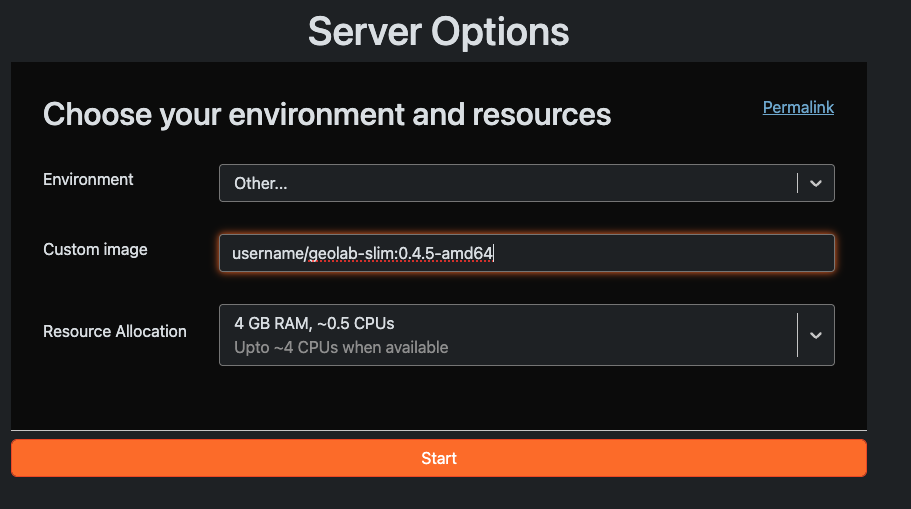

# **Building Custom GeoLab Images**

GeoLab environments run inside **Docker containers** — self-contained packages that bundle an operating system, software libraries, and Python packages together. This guide walks you through customizing the MSPASS GeoLab image by editing plain-text configuration files, then building the image locally and deploying it in a public repository such as Docker Hub.

## **Installing Docker Desktop**

You will need to install Docker Desktop to build and run images on your computer or make them available. If you are new to Docker, images, and containers, follow the [instructions](https://docs.docker.com/get-started/introduction/) to install Desktop for your operating system. Work through the [modules]([https://docs.docker.com/get-started/introduction/\#modules](https://docs.docker.com/get-started/introduction/#modules)) to learn how to build, run, and publish images.

After installing Docker Desktop, log into Docker. This enables saving or pushing an image to Docker Hub, Docker’s image repository.

## **Installing git**

Git is used to manage code. You will need git to make a copy of the GeoLab repository which contains the template for building custom images. Follow the [instructions]([https://github.com/git-guides/install-git](https://github.com/git-guides/install-git)) to install git. If you are unfamiliar with git, you can work through a [tutorial]([https://github.com/EarthScope/GeoLab-learning-hub/blob/main/tutorials/fundamentals/1\_git\_intro.ipynb](https://github.com/EarthScope/GeoLab-learning-hub/blob/main/tutorials/fundamentals/1_git_intro.ipynb)).

### **Cloning the repository**

Make a copy of this repository by cloning it using git.

```shell
cd ~  
git clone https://github.com/sparafina-earthscope/geolab-mspass.git  
```

## **Configuring an image**

A Docker image is a snapshot of a complete computing environment. When GeoLab launches, it starts a container from that image. The Dockerfile specifies how the image is built. Software and Python packages are installed from either the Dockerfile or the environment.yml file.

### **Installing Software**

The `RUN` command can be used to install software in the Dockerfile using apt. For example, this installs nano and vim text editors.

```text
RUN apt-get install nano \
    vim
```

### **Installing Python Packages**

Conda manages Python (and non-Python) packages within isolated environments. Edit `environment.yml` to add packages by name under the appropriate section. Always use the `conda-forge` channel for the broadest package availability unless otherwise specified in the package’s installation instructions

**Example:** Adding ObsPy Plus (`obsplus`) to the Geophysics section:

```
channels:
 - conda-forge
dependencies:
 ...
 # ── Geophysics ──────────────────────────────────────
 - dascore
 - gmt
 - obspy
 - obsplus
 ...
```

Some packages are only available on PyPI (Python's package index) and must be installed with `pip`. Add them to requirements.txt, one per line. You can pin a specific version with == to ensure reproducibility.

**Example:** Adding `gnss-lib-py`:

```shell
# --- EarthScope ---
earthscope-sdk==1.4.1
earthscope-cli==1.2.0
gnss-lib-py
```

## **Building and Pushing the Image**

Once the Dockerfile and environment.yml file are ready, build the image locally and push it to a container registry so GeoLab can access it.

Step 1 — Build the image

The `--platform linux/amd64` flag in the `build` command ensures the image runs on standard cloud hardware regardless of whether you're building on an Apple Silicon Mac or an Intel machine. Name the image using your repository username, a descriptive name and tag to track versions, such as `username/my_project:0.1.0`.

```shell
docker build --no-cache -f Dockerfile \
 --platform linux/amd64 \
 -t username/my_project:0.1.0 .
```

In this example, replace `username` with your Docker Hub username (or your registry path) and `0.1.0` with your version tag.What does `--no-cache` do? It forces Docker to rerun every build step from scratch, ensuring your latest environment.yml and Dockerfile changes are picked up rather than reused from a previous build.

Step 2 — Push to a registry

Push the image to Docker Hub, AWS ECR, or another registry so GeoLab can pull it. If you are using Docker Desktop and have logged into your account, you can push the image to Docker Hub with this command.

```shell
docker push username/my_project:0.1.0
```

If you use AWS ECR, follow these [instructions](https://docs.aws.amazon.com/AmazonECR/latest/userguide/docker-push-ecr-image.html).

## **Running Your Image in GeoLab**

1. Open GeoLab.  
2. Choose **Environment → Other**.  
     
3. Enter the full image name from your registry, e.g.: [**docker.io/username/shortcourse:0.1.0**](http://docker.io/username/shortcourse:0.1.0).  
     
4. Select **Start**.

GeoLab will pull and launch your custom environment. The first launch may take a minute while the image downloads. 